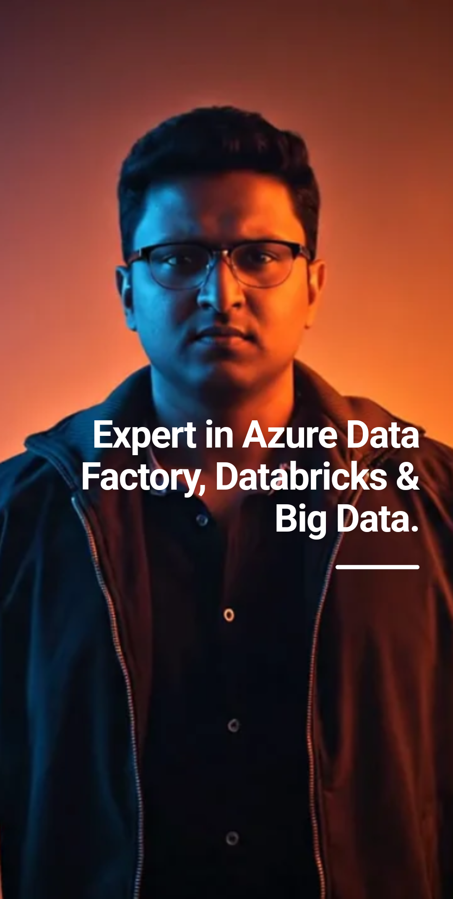

# Tushar Jadhav - Azure Data Engineer Portfolio

  

Personal portfolio website showcasing my experience, skills, and certifications as an **Azure Data Engineer**.

## 🌐 Live Demo
- Main site: [https://tjay143.in](https://tjay143.in)  
- Vercel deployment: [https://tjay143.vercel.app](https://tjay143.vercel.app)

## 🚀 Technologies Used
- **Framework**: Next.js (App Router)  
- **Language**: TypeScript  
- **Styling**: Tailwind CSS + PostCSS  
- **Deployment**: Vercel  
- **Other**: Modern React patterns, responsive design

## ✨ Features
- Clean, minimal single-page professional portfolio  
- Sections: Experience, Core Competencies / Skills, Certifications  
- Fast loading and mobile-responsive  
- Built with focus on data engineering / cloud technologies showcase

## 🛠️ My Professional Summary
Azure Data Engineer with hands-on experience in building scalable data pipelines and cloud-based solutions.

**Experience**  
- **John Deere Pvt Ltd** – Azure Data Engineer  
- **EC Mobility Pvt Ltd** – Relevant role (data/engineering focus)

**Core Competencies**  
- Azure Data Factory  
- Azure Databricks & PySpark  
- SQL Development  
- Python Programming  
- ETL Processes & Pipeline Design  
- Azure Synapse Analytics  
- Azure Storage Services  
- Microsoft Fabric  
- Cloud-based Data Solutions & Optimization  

**Certifications**  
- Databricks Lakehouse Fundamentals  
- Databricks Generative AI Fundamentals  

## 📂 Project Structure (Key Folders/Files)

├── public/              # Static assets (images, sequences, etc.) ├── resume/              # Resume files (PDF, parsed data) ├── src/                 # Main application code │   ├── app/             # Next.js App Router pages & layouts │   ├── components/      # Reusable UI components │   └── ...
├── next.config.mjs      # Next.js configuration ├── tailwind.config.ts   # Tailwind CSS config ├── tsconfig.json        # TypeScript configuration ├── package.json         # Dependencies └── parse.js             # Resume parsing script (if applicable)

📄 License
MIT License – feel free to use as inspiration for your own portfolio (but please don't copy content directly).

📬 Connect with Me
LinkedIn: https://www.linkedin.com/in/tushar-jadhav-175974154/
